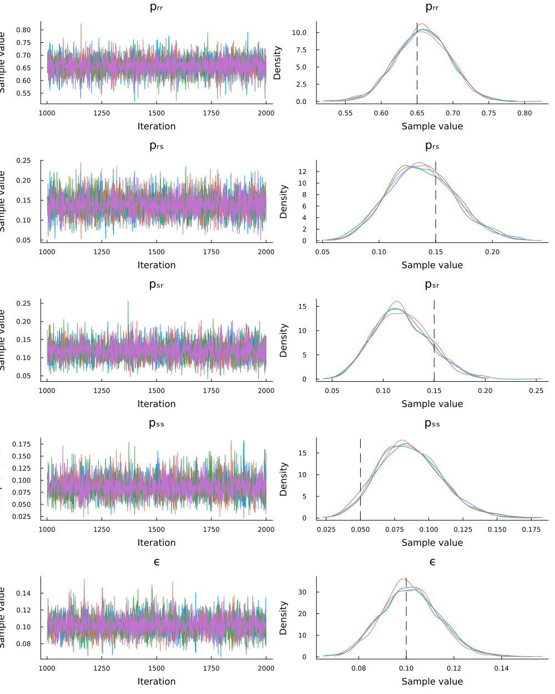

# A Simple Turing Model

It is possible to use [Turing.jl](https://turinglang.org/stable/) to perform Bayesian parameter estimation on models defined in SequentialSamplingModels.jl. Below, we show you how to estimate the parameters for the [Linear Ballistic Accumulator (LBA)](https://itsdfish.github.io/SequentialSamplingModels.jl/dev/lba/) and to use it to estimate effects.

Note that you can easily swap the LBA model from this example for other [SSM models](https://itsdfish.github.io/SequentialSamplingModels.jl/dev/api/) simply by changing the names of the parameters.

## Load Packages

The first step is to load the required packages. You will need to install each package in your local
environment in order to run the code locally. We will also set a random number generator so that the results are reproducible.

```julia
using Turing
using TrueAndErrorModels
using Random
using StatsPlots
using Random

Random.seed!(25044)
```

## Generate Data

We will use the [LBA](https://itsdfish.github.io/SequentialSamplingModels.jl/dev/lba/) distribution to simulate data (100 trials) with fixed parameters (those we want to recover only from the data using Bayesian modeling).

```julia
# Generate some data with known parameters
dist = TrueErrorModel(; p = [0.60, .30, .05, .05], ϵ = fill(.10, 4))
data = rand(dist, 200)
```

```julia 
16-element Vector{Int64}:
 80
 13
  8
  1
 16
 35
  ⋮
  8
  2
  3
  9
  1
  9
```

The `rand()` function will sample random draws from the distribution, and store that into a named tuple of 2 vectors (one for `choice` and one for `rt`). The individual vectors can be accessed by their names using `data.choice` and `data.rt`.

## Specify Turing Model

The code snippet below defines a model in Turing. The model function accepts a tuple containing
a vector of choices and a vector of reaction times. The sampling statements define the prior distributions for each parameter. The non-decision time parameter $\tau$ must be founded by the minimum reaction time, `min_rt`. The last sampling statement defines the likelihood of the data given the sampled parameter values.

```julia
@model function model(data)
    p ~ Dirichlet(fill(1, 4))
    ϵ ~ filldist(Uniform(0, .5), 4)
    data ~ TrueErrorModel(p, ϵ)
end
```

## Estimate the Parameters

Finally, we perform parameter estimation with `sample()`, which takes the model, and details about the sampling algorithm:

1. `model(data)`: the Turing model with data passed
2. `NUTS(1000, .65)`: a sampler object for the No U-Turn Sampler for 1000 warmup samples.
3. `MCMCThreads()`: instructs Turing to run each chain on a separate thread
4. `n_iterations`: the number of iterations performed after warmup
5. `n_chains`: the number of chains

```julia
# Estimate parameters
chains = sample(model(data), NUTS(1000, .65), MCMCThreads(), 1000, 4)
```

```julia
Chains MCMC chain (1000×20×4 Array{Float64, 3}):

Iterations        = 1001:1:2000
Number of chains  = 4
Samples per chain = 1000
Wall duration     = 2.11 seconds
Compute duration  = 6.21 seconds
parameters        = p[1], p[2], p[3], p[4], ϵ[1], ϵ[2], ϵ[3], ϵ[4]
internals         = lp, n_steps, is_accept, acceptance_rate, log_density, hamiltonian_energy, hamiltonian_energy_error, max_hamiltonian_energy_error, tree_depth, numerical_error, step_size, nom_step_size

Summary Statistics
  parameters      mean       std      mcse    ess_bulk    ess_tail      rhat   ess_per_sec 
      Symbol   Float64   Float64   Float64     Float64     Float64   Float64       Float64 

        p[1]    0.5310    0.0844    0.0021   1611.5020   1931.9193    1.0008      259.5011
        p[2]    0.2536    0.0725    0.0017   1882.4309   2316.0608    1.0006      303.1290
        p[3]    0.1033    0.0512    0.0013   1520.5778   2258.6363    1.0006      244.8596
        p[4]    0.1121    0.0443    0.0010   1999.5107   2448.4595    1.0012      321.9824
        ϵ[1]    0.0654    0.0328    0.0008   1521.5648   1140.1998    1.0025      245.0185
        ϵ[2]    0.0984    0.0479    0.0011   1750.7039   1641.4243    1.0008      281.9169
        ϵ[3]    0.3015    0.1241    0.0030   1641.3979   1858.2680    1.0034      264.3153
        ϵ[4]    0.1382    0.0810    0.0019   1744.5089   1863.3155    1.0014      280.9193

Quantiles
  parameters      2.5%     25.0%     50.0%     75.0%     97.5% 
      Symbol   Float64   Float64   Float64   Float64   Float64 

        p[1]    0.3662    0.4706    0.5323    0.5931    0.6851
        p[2]    0.1378    0.1994    0.2444    0.2985    0.4119
        p[3]    0.0276    0.0635    0.0967    0.1349    0.2171
        p[4]    0.0427    0.0793    0.1064    0.1404    0.2091
        ϵ[1]    0.0060    0.0410    0.0655    0.0891    0.1292
        ϵ[2]    0.0087    0.0622    0.1018    0.1343    0.1841
        ϵ[3]    0.0438    0.2090    0.3166    0.4040    0.4880
        ϵ[4]    0.0116    0.0714    0.1318    0.1998    0.2997
```

```julia
name_map = Dict(
    "p[1]" => "pᵣᵣ",
    "p[2]" => "pᵣₛ",
    "p[3]" => "pₛᵣ",
    "p[4]" => "pₛₛ",
    "ϵ[1]" => "ϵᵣₛ₁",
    "ϵ[2]" => "ϵᵣₛ₂",
    "ϵ[3]" => "ϵₛᵣ₁",
    "ϵ[4]" => "ϵₛᵣ₂",
)
chains = replacenames(chains, name_map)
```
## Posterior Summary

We can compute a description of the posterior distributions.

```julia
# Summarize posteriors
summarystats(chains)
```

```julia 
Summary Statistics
  parameters      mean       std      mcse    ess_bulk    ess_tail      rhat   ess_per_sec 
      Symbol   Float64   Float64   Float64     Float64     Float64   Float64       Float64 

         pᵣᵣ    0.5310    0.0844    0.0021   1611.5020   1931.9193    1.0008      259.5011
         pᵣₛ    0.2536    0.0725    0.0017   1882.4309   2316.0608    1.0006      303.1290
         pₛᵣ    0.1033    0.0512    0.0013   1520.5778   2258.6363    1.0006      244.8596
         pₛₛ    0.1121    0.0443    0.0010   1999.5107   2448.4595    1.0012      321.9824
        ϵᵣₛ₁    0.0654    0.0328    0.0008   1521.5648   1140.1998    1.0025      245.0185
        ϵᵣₛ₂    0.0984    0.0479    0.0011   1750.7039   1641.4243    1.0008      281.9169
        ϵₛᵣ₁    0.3015    0.1241    0.0030   1641.3979   1858.2680    1.0034      264.3153
        ϵₛᵣ₂    0.1382    0.0810    0.0019   1744.5089   1863.3155    1.0014      280.9193
```

As you can see, based on the mean values of the posterior distributions, the original parameters (`ν=[3.0, 2.0], A = .8, k = .2, τ = .3`) are successfully recovered from the data (the accuracy would increase with more data).


## Evaluation

It is important to verify that the chains converged. We see that the chains converged according to $\hat{r} \leq 1.05$, and the trace plots below show that the chains look like "hairy caterpillars", which indicates the chains did not get stuck. As expected, the posterior distributions are close to the data generating parameter values.

```julia
plot(chains)
```

