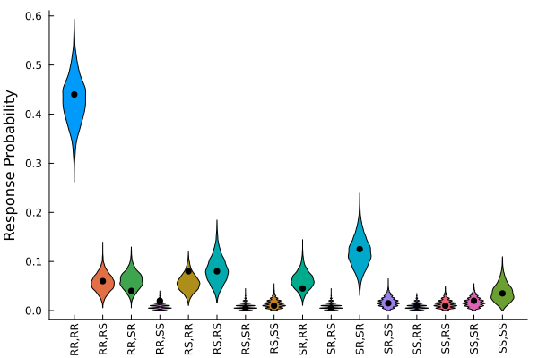

```@raw html

```
# Bayesian Parameter Estimation

The purpose of this tutorial is to demonstrate how to generate and plot prior and posterior predictive distributions of a True and Error Theory model (TET; Birnbaum & Quispe-Torreblanca, 2018) using the [Turing.jl](https://turinglang.org/) package. 

## Full Code 

You can reveal copy-and-pastable version of the full code by clicking the ▶ below.

```@raw html
<details>
<summary><b>Show Full Code</b></summary>
```
```julia
using Random
using StatsPlots
using TrueAndErrorModels
using Turing
using TuringUtilities
Random.seed!(6521)

dist = TrueErrorModel(; p = [0.65, 0.15, 0.15, 0.05], ϵ = fill(0.10, 4))
n_sim = 200
data = rand(dist, n_sim)

model = tet1_model(data)
chains = sample(model, NUTS(1000, 0.65), MCMCThreads(), 1000, 4)

pred_model = predict_distribution(;
    simulator = Θ -> rand(TrueErrorModel(; Θ...), n_sim),
    model,
    func = x -> x ./ sum(x)
)

post_preds = generated_quantities(pred_model, chains)
post_preds = stack(post_preds, dims = 1)

labels = get_response_labels()
violin(
    post_preds,
    xticks = (1:length(labels), labels),
    ylabel = "Response Probability",
    leg = false,
    grid = false,
    xrotation = 90
)
scatter!(1:16, data ./ sum(data), color = :black)
```
```@raw html
</details>
```

## Load Packages

The first step is to load the required packages. You will need to install each package in your local
environment in order to run the code locally. We will also set a random number generator so that the results are reproducible.

```julia
using Random
using StatsPlots
using TrueAndErrorModels
using Turing
using TuringUtilities
Random.seed!(6521)
```

## Generate Data

For a description of the decision making task, please see the description in the [model overview](https://itsdfish.github.io/TrueAndErrorModels.jl/dev/overview/). In the code block below, we will create a model object and generate 2 simulated responses from 100 simulated subjects for a total of 200 responses. 
```julia
dist = TrueErrorModel(; p = [0.65, 0.15, 0.15, 0.05], ϵ = fill(0.10, 4))
n_sim = 200
data = rand(dist, n_sim)
```
```julia
16-element Vector{Int64}:
 88
 12
  8
  4
  ⋮
  2
  2
  4
  7
```

 ## Estimate the Parameters

In the code block below, we will create a model object for a TET model with 1 error probability parameter. Note that if you develop a custom model, it must return a `NamedTuple` of parameters in order to generate predictive distributions, as illustrated below. 
```julia
model = tet1_model(data)
chains = sample(model, NUTS(1000, 0.65), MCMCThreads(), 1000, 4)
```

## Generate Posterior Predictive Model

The code block below creates a model for generating a predictive distribution. The inputs for `predict_distribution` are defined as follows:

- `simulator`: a function that generates simulated data from the model
- `model`: a Turing model with data attached 
- `func`: an arbitrary function applied to the simulated data. In this case, the simulated data are     normalized as response probabilities. 

```julia 
pred_model = predict_distribution(;
    simulator = Θ -> rand(TrueErrorModel(; Θ...), n_sim),
    model,
    func = x -> x ./ sum(x)
)
```

## Generate Predictive Distribution

The next step is to call `generated_quantities` to sample from the predictive distribution. If you passed `Prior()` to `sample` above, a prior predictive distribution will be used. Otherwise, it will generate a
posterior predictive distribution. The second line of code combines the four chains for each response pattern. Each row corresponds to a posterior predictive sample, and each column corresponds to a different response pattern. 
```julia
post_preds = generated_quantities(pred_model, chains)
post_preds = stack(post_preds, dims = 1)
```
```julia
4000×16 Matrix{Float64}:
 0.455  0.095  0.065  0.015  0.06   0.08   0.0    0.025  0.055  0.005  0.07   0.015  0.005  0.01   0.02   0.025
 0.44   0.045  0.025  0.01   0.075  0.065  0.0    0.005  0.06   0.0    0.17   0.01   0.005  0.015  0.035  0.04
 0.43   0.06   0.055  0.015  0.045  0.06   0.01   0.015  0.04   0.005  0.135  0.015  0.0    0.02   0.015  0.08
 0.415  0.07   0.09   0.01   0.025  0.08   0.01   0.015  0.05   0.01   0.155  0.02   0.01   0.01   0.01   0.02
 0.41   0.06   0.05   0.005  0.06   0.06   0.005  0.01   0.06   0.015  0.15   0.02   0.01   0.02   0.025  0.04
 0.455  0.06   0.045  0.025  0.03   0.105  0.0    0.0    0.06   0.005  0.1    0.025  0.015  0.01   0.015  0.05
 0.365  0.06   0.07   0.02   0.09   0.065  0.03   0.0    0.04   0.015  0.14   0.025  0.03   0.005  0.01   0.035
 0.39   0.075  0.075  0.005  0.105  0.085  0.01   0.0    0.085  0.005  0.09   0.005  0.01   0.015  0.02   0.025
 0.455  0.055  0.055  0.005  0.045  0.095  0.0    0.01   0.04   0.0    0.165  0.005  0.005  0.025  0.015  0.025
 ⋮                                  ⋮                                  ⋮                                  ⋮
 0.365  0.055  0.06   0.015  0.06   0.125  0.02   0.005  0.045  0.025  0.13   0.01   0.005  0.01   0.01   0.06
 0.455  0.03   0.04   0.01   0.035  0.125  0.015  0.01   0.04   0.015  0.145  0.015  0.01   0.01   0.0    0.045
 0.395  0.11   0.075  0.01   0.03   0.12   0.015  0.025  0.045  0.005  0.08   0.015  0.005  0.035  0.02   0.015
 0.41   0.075  0.045  0.005  0.075  0.12   0.01   0.005  0.03   0.005  0.165  0.01   0.005  0.01   0.015  0.015
 0.395  0.03   0.05   0.03   0.095  0.12   0.015  0.015  0.035  0.02   0.105  0.01   0.015  0.01   0.025  0.03
 0.465  0.055  0.045  0.005  0.04   0.09   0.0    0.0    0.05   0.0    0.14   0.015  0.015  0.02   0.005  0.055
 0.53   0.03   0.025  0.005  0.07   0.07   0.005  0.005  0.035  0.005  0.135  0.005  0.0    0.025  0.015  0.04
 0.425  0.05   0.07   0.015  0.075  0.06   0.0    0.02   0.065  0.005  0.13   0.015  0.01   0.015  0.015  0.03
 0.455  0.045  0.07   0.015  0.05   0.09   0.01   0.015  0.085  0.005  0.09   0.015  0.02   0.005  0.02   0.01
```
 ## Plot Predictive Distributions

Lastly, we will plot the posterior predictive distributions as violin plots. The first line of code gets a pre-made vector of response category labels. The function `violin` generates a violin plot and rotates the response category labels by 90 degrees for readability. The final line of code plots the data as black dots. As expected, the data are typically located near the bulk of the posterior predictive density. 

```julia
labels = get_response_labels()
violin(
    post_preds,
    xticks = (1:length(labels), labels),
    ylabel = "Response Probability",
    leg = false,
    grid = false,
    xrotation = 90
)
scatter!(1:16, data ./ sum(data), color = :black)
```

 